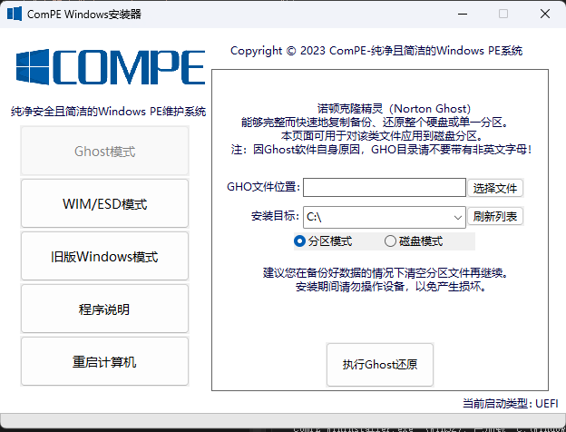
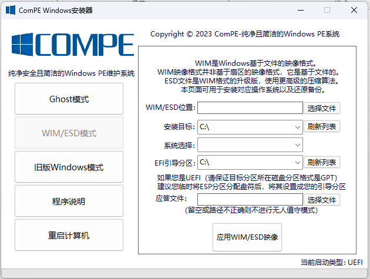
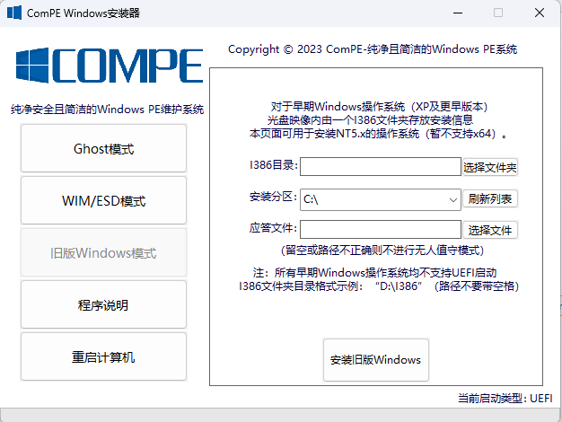

# ComPE Windows 安装器

本程序采用C++制作，使用 Windows API库和WimLib库（非Wimlib-ImageX.exe），并少量使用Python语言编写，程序可以对Ghost映像，WIM/ESD映像和NT5.x的早期系统进行安装。

程序使用官方的Ghost程序命令行实现Ghost映像的还原，可以对分区和磁盘进行操作，选择指定的Ghost映像后，选择目标，就可以执行了。

程序使用WimLib库以实现对WIM/ESD文件的应用，而不是使用Wimlib-ImageX.exe命令行实现，所以源代码中未见对该exe的调用，程序是用WimLib头文件和libwim.lib与libwim.dll通信的，以调用DLL中的函数应用WIM/ESD到指定分区，并且获取WIM中镜像信息。

根据Windows XP的软盘组的方式，程序会通过复制指定文件的方式部署好文本模式安装程序（TXTSETUP），由于我对C++复制文件用不好，所以这里是用Python写的复制程序完成的。从I386文件夹中选择正确的文件复制，并重启后自动完成一些操作。

官网链接：https:// win-compe.top
